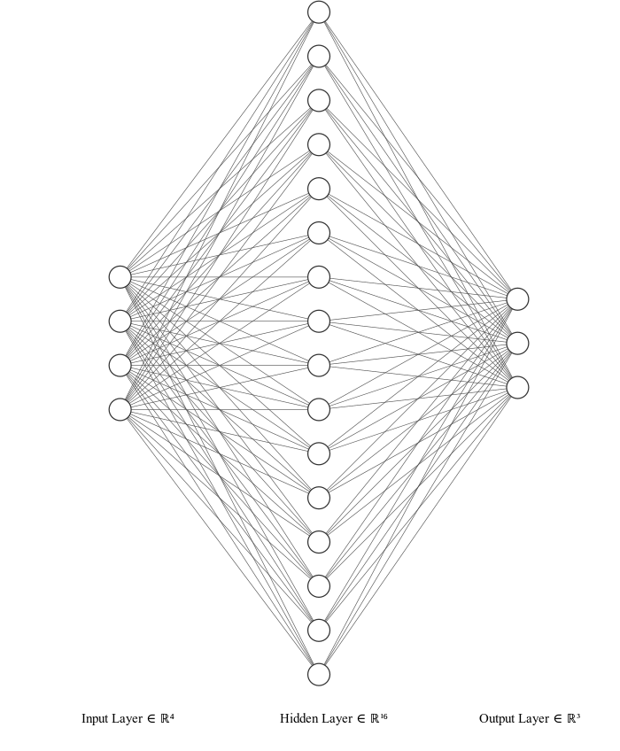

# iris

dynetでirisの分類をしてみましょう

irisのデータセットは[ここ](http://archive.ics.uci.edu/ml/datasets/Iris)
からダウンロードできます．

irisはアヤメの分類を行うデータセットです．
４つの情報からアヤメの種類を学習・推測するものになります．

このデータセットはパターン認識のための最もよく知られたものです．
このデータセットは３つの種類のアヤメのデータがそれぞれ５０個ずつ含まれています．
一つのアヤメは他の２つと線形分離可能です．

## 1.データの中身

### 1.1 アヤメの種類

- setosa 
- versicolor
- virginica

それぞれのデータが５０個ずつ含まれています．

### 1.2 含まれている情報

- ガク片（sepal)の幅・長さ(cm)
- 花弁（petal)の幅・長さ(cm)

### 1.3 情報量

- 情報数:150
- 欠損情報:無し

### 1.4 データの構成

1. sepal length(cm)
2. sepal width(cm)
3. petal length(cm)
4. petal width(cm)
5. class:
	- Iris Setosa
	- Iris Versicolor
	- Iris Virginica

### 1.5 統計

| |Min|Max|Mean|Standard deviation|Class correlation|
|-|:-:|:-:|:--:|:----------------:|:---------------:|
|sepal length|4.3|7.9|5.84|0.83|0.7826|
|sepal width|2.0|4.4|3.05|0.43|-0.4194|
|petal length|1.0|6.9|3.76|1.76|0.9490(high!)|
|petal width|0.1|2.5|1.2|0.76|0.9565(high!)|

## 2. データセットのエンコード 

データセットは下記のように文字列でラベル付されているので，
これを学習でも使用できるようにone-hot表現に変換（エンコード）する必要があります．

`setosa, versicolor, virginica`->`0,0,1`

## 3. 実装

今回は下記のようなニューラルネットを構築します．
データセットに含まれている情報は４つあるので，入力層は４ノードとなります．
また，アヤメは３種類に分類されるので出力層のノード数は３であることがわかります．
残りは中間層を決定すれば良いのですが，今回は１層，１６ノードで構成することにします．
この１６ノードにバイアスノードは含まれていません．計算では含まれますが，
ここではわかりやすさ重視で無視します．**実際はバイアスノードはあります.かっこよさ重視で下記の図にないだけです．**

## 数式

各変数（パラメータ）のサイズは下記のとおりです．

- $\boldsymbol{x} : 4 \times 1$
- $\boldsymbol{W^{(1)}} : 16 \times 4$
- $\boldsymbol{b^{(1)}} : 16 \times 1$
- $\boldsymbol{z^{(1)}} : 16 \times 1$
- $\boldsymbol{W^{(2)}} : 3 \times 16$
- $\boldsymbol{b^{(2)}} : 3 \times 1$
- $\boldsymbol{\hat{y}} : 3 \times 1$

計算式（各変数の関係）は下記のとおりです．

$$
\begin{equation}
\boldsymbol{z^{(1)}} = f^{(1)}(
\boldsymbol{W^{(1)}}
\boldsymbol{x}+\boldsymbol{b^{(1)}}
)
\end{equation}
$$

$$
\boldsymbol{\hat{y}} = f^{(2)}(
\boldsymbol{W^{(2)}}\boldsymbol{z^{(1)}}+\boldsymbol{b^{(2)}}
)
$$

## 実装
