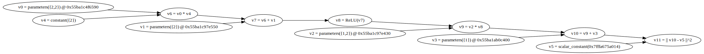

# XOR

## 論理ゲート

```
A----++++
      ++++++-----Z
B----++++
```

### AND(論理積）

```math
論理式: Z = AB
```

|A|B|Z|
|-|-|-|
|0|0|0|
|0|1|0|
|1|0|0|
|1|1|1|

### OR（論理和）

```math
論理式: Z = A+B
```

|A|B|Z|
|-|-|-|
|0|0|0|
|0|1|1|
|1|0|1|
|1|1|1|

### NOT（論理否定）

```
A-----+++++----Z
```

|A|Z|
|-|-|
|0|1|
|1|0|

### NAND (NOT of AND)

全てが１のときのみ０

|A|B|Z|
|-|-|-|
|0|0|1|
|0|1|1|
|1|0|1|
|1|1|0|

### XOR(eXclusive OR:排他的論理和）

不一致和（A != Bのとき１）

|A|B|Z|
|-|-|-|
|0|0|0|
|0|1|1|
|1|0|1|
|1|1|0|

## Deeplearningから見たXOR

適当な入力ベクトルxを入れると，それが1か0かを判定するネットワークを作成する．

### トレーニングデータ

$$
\begin{equation}
X= 
\begin{bmatrix}
0 & 0 \\
0 & 1 \\
1 & 0 \\
1 & 1 \\
\end{bmatrix}
\end{equation}
$$

$$
\begin{equation}
y= 
\begin{bmatrix}
0  \\
1  \\
1  \\
0  \\
\end{bmatrix}
\end{equation}
$$

### Computation Graph

## 実際にやってみるXOR

### １．隠れ層のノード数が３つのバージョン（単純）

#### 1.1 計算式

下記のような計算グラフを構築してXORを解いてみる．


また，各変数の定義は下記のとおりです．

!!! note
	計算グラフの表現と線形代数的な表現の違いに注意しましょう．
	例えば，計算グラフではバイアス$\boldsymbol{b^1}$は１つのノードですが，
	線形代数の表現においては要素数２のベクトルです．
	dynetでは線形代数的な表現を用いてグラフを構築していきます．

$$
\begin{equation}
\boldsymbol{x} = 
\begin{bmatrix}
x_1 \\
x_2 \\
\end{bmatrix}
\end{equation}
$$

$$
\begin{equation}
\boldsymbol{W^{(1)}} = 
\begin{bmatrix}
\omega^1_{11} & \omega^1_{12}\\
\omega^1_{21} & \omega^1_{22}\\
\end{bmatrix}
\end{equation}
$$

$$
\begin{equation}
\boldsymbol{b^{(1)}} = 
\begin{bmatrix}
b^1_{1} \\
b^1_{2}\\
\end{bmatrix}
\end{equation}
$$

$$
\begin{equation}
\boldsymbol{W^{(2)}} = 
\begin{bmatrix}
\omega^2{11} & \omega^2_{12}\\
\end{bmatrix}
\end{equation}
$$

!!! note
	重み行列は**行列**です．したがって$\boldsymbol{W^{(2)}}$は行列になります．
	要素数が２つしかないとは言え行列ですので，横長の形になります．$\boldsymbol{W^{(2)}}$を要素数２のベクトルだと勘違いすると，
	縦長の形を想像し，$\boldsymbol{W^{(2)}z^{(1)}}$の計算がうまく行かなくなります.

$$
\begin{equation}
\boldsymbol{b^{(2)}} = 
\begin{bmatrix}
b^2_{1} \\
\end{bmatrix}
\end{equation}
$$

$$
\begin{equation}
\boldsymbol{z^{(1)}} = 
\begin{bmatrix}
z^1_1 \\
z^1_2 \\
\end{bmatrix}
\end{equation}
$$

$$
f^{(1)} = ReLU \\
f^{(2)} = 1
$$

この内，
$\boldsymbol{W^1}$,
$\boldsymbol{W^2}$,
$\boldsymbol{b^1}$,そして
$\boldsymbol{b^2}$
はdynetでいう`Parameter`であり学習によって獲得されます．

計算式は下記のようになります．

$$ 
\boldsymbol{z^1} = f^{(1)} ( \boldsymbol{W^1x} + \boldsymbol{b^1} ) \\
\hat{y} = f^{(2)} ( \boldsymbol{W^2x} + \boldsymbol{b^2} )
$$

#### 1.2 実装の前に手で解いてみる

dynetに計算させる前に，自分でXOR問題をこのネットワークが解けるかどうか
試してみましょう．まず，下記のようにそれぞれ値が与えられたとします．

$$ 
y = 1
$$

$$
\begin{equation}
\boldsymbol{x} = 
\begin{bmatrix}
0 \\
1
\end{bmatrix}
\end{equation}
$$

$$
\begin{equation}
\boldsymbol{W^{(1)}} = 
\begin{bmatrix}
1 & 1 \\
1 & 1 \\
\end{bmatrix}
\end{equation}
$$

$$
\begin{equation}
\boldsymbol{b^{(1)}} = 
\begin{bmatrix}
0 \\
1 \\
\end{bmatrix}
\end{equation}
$$

$$
\begin{equation}
\boldsymbol{W^{(2)}} = 
\begin{bmatrix}
1 & -2
\end{bmatrix}
\end{equation}
$$

$$
\begin{equation}
\boldsymbol{b^{(2)}} = 
\begin{bmatrix}
0 \\
\end{bmatrix}
\end{equation}
$$

すると，

$$
\begin{equation}
\boldsymbol{u^{(1)}} = \boldsymbol{W^{(1)}x}
= 
\begin{bmatrix}
1 & 1 \\
1 & 1 \\
\end{bmatrix}
\end{equation}
\begin{bmatrix}
0 \\
1
\end{bmatrix}
= 
\begin{bmatrix}
1 \\
1
\end{bmatrix}
$$

$$
\begin{equation}
\boldsymbol{z^{(1)}} = f^{(1)}(\boldsymbol{u^{(1)}} + \boldsymbol{b^{(1)}})
\end{equation}
= 
\begin{bmatrix}
1 \\
0
\end{bmatrix}
$$

$$
\begin{equation}
\boldsymbol{u^{(2)}} = \boldsymbol{W^{(1)}x}
= 
\begin{bmatrix}
1 & -2 \\
\end{bmatrix}
\end{equation}
\begin{bmatrix}
1 \\
0
\end{bmatrix}
= 
1
$$

$$
\boldsymbol{z^{(2)}} = f^{(2)}(1) = 1
$$

よって$y = \hat{y}$となり，少なくとも$\boldsymbol{x}=(0,1)^T$においては
学習が可能なことが示された．ちなみに，$\boldsymbol{x}$が他の場合においても
やってみるとうまく行くことがわかる．

#### 1.3 実装
おまたせしました．dynetで実装してみましょう．

注意することが１つあります．我々はこれからニューラルネットをプログラムで表現
するのではなく，計算グラフを表現するということです．つまり層を積んでいくのではなく
線形代数を利用したプログラムを作る感覚です．

今回は下記のような計算グラフを実装します．



```C++
#include <iostream>
#include <vector>
#include <dynet/training.h>
#include <dynet/expr.h>
#include <dynet/model.h>
#include <gpop/Series.hpp>

int main(int argc, char* argv[])
{

	// dynetの初期化
	dynet::initialize(argc, argv);

	// 設定
	const int ITERATIONS = 30;
	const int HIDDEN_L1_SIZE = 2;

	// 計算グラフを構築
	dynet::ParameterCollection model;
	dynet::SimpleSGDTrainer trainer(model);

	// パラメータを設定 (パラメータ = 最適化される変数）
	// W1 (2x2) のパラメータを作成
	dynet::Parameter p_W1 = model.add_parameters({HIDDEN_L1_SIZE, 2});
	// b1 (2x1) のパラメータを作成
	dynet::Parameter p_b1 = model.add_parameters({HIDDEN_L1_SIZE});
	// W2 (1x2) のパラメータを作成
	dynet::Parameter p_W2 = model.add_parameters({1, HIDDEN_L1_SIZE});
	// b2 (1x1) のパラメータを作成
	dynet::Parameter p_b2 = model.add_parameters({1});

	// ノードの作成と計算グラフへの登録
	dynet::ComputationGraph cg;
	dynet::Expression W1 = dynet::parameter(cg, p_W1);
	dynet::Expression b1 = dynet::parameter(cg, p_b1);
	dynet::Expression W2 = dynet::parameter(cg, p_W2);
	dynet::Expression b2 = dynet::parameter(cg, p_b2);
	// ニューラルネット及び，計算グラフへの入力変数x_valueを宣言し，変更可能にするために参照渡しをします．
	std::vector<dynet::real> x_value(2);
	dynet::Expression x  = dynet::input(cg, {2}, &x_value);
	// ニューラルネット及び，計算グラフへの入力変数y_valueを宣言し，変更可能にするために参照渡しをします．
	dynet::real y_value;
	dynet::Expression y = dynet::input(cg, &y_value);
	// 計算グラフにノードの接続関係を宣言する．
	dynet::Expression z1 = dynet::rectify(W1*x+b1);
	dynet::Expression y_pred = W2*z1+b2;
	dynet::Expression loss_expr = dynet::squared_distance(y_pred, y);

	// 構築した計算グラフを描いてみる．それが僕には楽しかったから
	cg.print_graphviz();

	// 誤差を記録する
	std::vector<double> loss_vec;

	// 教師データを作成し，学習させてみる
	for (int iter = 0; iter < ITERATIONS; iter++) {
		double loss_value = 0;
		for (int mi = 0; mi < 4; mi++) {
			//教師データの作成開始(x,y)
			bool x1 = mi%2;
			bool x2 = (mi / 2)%2;
			std::cout << "x1 : x2 " << std::boolalpha << x1 << "\t" << x2 << std::endl;
			x_value[0] = x1 ? 1 : -1;
			x_value[1] = x2 ? 1 : -1;
			std::cout << "x_value[0] : " << x_value[0] << "\t" << "x_value[1] : " << x_value[1] << std::endl;
			y_value = (x1 != x2) ? 1 : -1;
			//教師データの作成終了(x,y)
			//学習実行
			loss_value += dynet::as_scalar(cg.forward(loss_expr));
			cg.backward(loss_expr);
			trainer.update();
		}
		loss_value /= 4;
		std::cout << "E = " << loss_value << std::endl;
		loss_vec.push_back(loss_value);
	}

	// 誤差をプロットする
	Series plot("error");
	plot.plot(loss_vec);
	plot.show();
	std::cin.get();

	// 結果を確かめる
	x_value[0] = -1;
	x_value[1] = -1;
	cg.forward(loss_expr);
	std::cout << "[-1,-1] -1 : " << dynet::as_scalar(y_pred.value()) << std::endl;
	x_value[0] = -1;
	x_value[1] = 1;
	cg.forward(loss_expr);
	std::cout << "[-1,1] 1 : " << dynet::as_scalar(y_pred.value()) << std::endl;
	x_value[0] = 1;
	x_value[1] = -1;
	cg.forward(loss_expr);
	std::cout << "[1,-1] 1 : " << dynet::as_scalar(y_pred.value()) << std::endl;
	x_value[0] = 1;
	x_value[1] = 1;
	cg.forward(loss_expr);
	std::cout << "[1,1] -1 : " << dynet::as_scalar(y_pred.value()) << std::endl;

	return 0;
}
```

#### 1.4 結果

うまく行くと，誤差は下記の図のように小さくなっていきます．


しかしながら，これはかなりうまくいった結果です．このようにならなくても
心配しないでください．このニューラルネットはとても小さいのでうまく学習できるかどうかは
初期ランダムシードに依存します．数回実行してみてください．

### 2．隠れ層のノード数が8つのバージョン（公式）


!!! note
	[xor example](https://github.com/clab/dynet/blob/master/examples/xor/train_xor.cc)

### プログラムの全体像

!!! note 
	[xorの数学的解説](http://gtech.hatenablog.com/entry/2016/07/30/141647)

**モデルの式**
$$
\hat{y} = \sigma ( \textbf{v} \cdot \tanh(\textbf{Ux} + \textbf{b}))
$$

```c++
#include "dynet/training.h"
#include "dynet/expr.h"
#include "dynet/io.h"
#include "dynet/model.h"

#include <fstream>

using namespace std;
using namespace dynet;

int main(int argc, char** argv) {
  dynet::initialize(argc, argv);

  const unsigned ITERATIONS = 30;

  //  ParameterCollection (all the model parameters)
  ParameterCollection m;
  SimpleSGDTrainer trainer(m);
  //MomentumSGDTrainer trainer(m);

  Parameter p_W, p_b, p_V, p_a;
  const unsigned HIDDEN_SIZE = 3;
  p_W = m.add_parameters({HIDDEN_SIZE, 2});
  p_b = m.add_parameters({HIDDEN_SIZE});
  p_V = m.add_parameters({1, HIDDEN_SIZE});
  p_a = m.add_parameters({1});

  // train the parameters
  for (unsigned iter = 0; iter < ITERATIONS; ++iter) {

    ComputationGraph cg;
    Expression W = parameter(cg, p_W);
    Expression b = parameter(cg, p_b);
    Expression V = parameter(cg, p_V);
    Expression a = parameter(cg, p_a);

    vector<Expression> losses;

    for (unsigned mi = 0; mi < 4; ++mi) {

      bool x1 = mi % 2;
      bool x2 = (mi / 2) % 2;
      vector<dynet::real> x_values(2);
      x_values[0] = x1 ? 1 : -1;
      x_values[1] = x2 ? 1 : -1;
      float y_value = (x1 != x2) ? 1 : -1;

      Expression x = input(cg, {2}, x_values);
      Expression y = input(cg, y_value);

      //Expression h = tanh(W*x + b);
      Expression h = tanh(affine_transform({b, W, x}));
      //Expression h = softsign(W*x + b);
      Expression y_pred = affine_transform({a, V, h});
      losses.push_back(squared_distance(y_pred, y));

    }

    Expression loss_expr = sum(losses);

    // Print the graph, just for fun.
    if(iter == 0) {
      cg.print_graphviz();
    }

    // Calculate the loss. Batching will automatically be done here.
    float loss = as_scalar(cg.forward(loss_expr)) / 4;
    cg.backward(loss_expr);
    trainer.update();

    cerr << "E = " << loss << endl;
  }

}
```

!!! TODO
	referenceを調べて，各関数の説明を付け加える

### include

```c++
#include <dynet/training.h>
#include <dynet/expr.h>

#include <iostream>
#include <fstream>
```

### namespace

```c++
using namespace std;
using namespace dynet;
```

### initialize

```c++
dynet::initialize(argc, argv);
```

### parameter setting1

全ての重みパラメータwが登録されている`ParameterCollection`wを作成する．
そして，その重みパラメータを更新するための`SGDTrainer`を作成し，
`SGDTrainer`に`ParameterCollection`を渡す．

```c++
const unsigned ITERATIONS = 30;
ParameterCollection m;
SimpleSGDTrainer trainer(m);
```

### parameter setting

```c++
Prameter p_W, p_b, p_V, p_a;
const unsigned HIDDEN_SIZE = 3;
p_W = m.add_parameters({HIDDEN_SIZE, 2});
p_b = m.add_parameters({HIDDEN_SIZE});
p_V = m.add_parameters({1, HIDDEN_SIZE});
p_a = m.add_parameters({1});
```

### train the parameters

dynetのトレーニングフェーズは`for文`で回します．

```c++
for (unsigned inter = 0 iter < ITERATIONS; ++iter) {
	
	ComputationGraph cg;
	Expression W = parameter(cg, p_W);
	Expression b = parameter(cg, p_b);
	Expression V = parameter(cg, p_V);
	Expression a = parameter(cg, p_a);

	vector<Expression> losses;
}
```

### 教師データ作成

!!! note	"三項演算子"
	[?:文]は条件分岐処理の１つで，条件が真か偽により処理を分岐します．
	[if文]を短縮して書いたような記述方法になります．

	```
	条件式 ? 真の場合の文 : 偽の場合の文
	```

	注意点としては条件の分岐結果が変数やリテラルなどの**値**になっていなければ
	ならないことです．よく代入演算子と一緒に利用されます．

	```
	bool variable = (result) ? true : false;
	```

```c++
for (unsigned mi = 0; mi < 4; ++mi) {
	
	// 入力ベクトルを作成
	bool x1 = mi % 2;		// 0 -> false, 1 -> true,  2 -> false, 3 -> true 偶奇判定
	bool x2 = (mi / 2) % 2;	// 0 -> false, 1 -> false, 2 -> true, 3 -> true

	vector<dynet::real> x_values(2);	// dynet::realはfloatと同等

	x_value[0] = x1 ? 1 : -1;
	x_value[1] = x2 ? 1 : -1;
	float y_value = (x1 != x2) ? 1 : -1;
```

XORを[0,1]ではなく[-1,1]であわらしていると思われる．４イテレーション全部を
計算すると下記の表のようになる．

|(indecs)mi|x_value[0]|x_value[1]|y_value|
|----------|----------|----------|-------|
|0         |-1        |-1        |-1     |
|1         |1         |-1        |1      |
|2         |-1        |1         |1      |
|3         |1         |1         |-1     |

|A|B|Z|
|-|-|-|
|0|0|0|
|0|1|1|
|1|0|1|
|1|1|0|

### 

### expression

```c++
Expression x = input(cg, {2}, x_values);
Expression y = input(cg, y_value);
```
